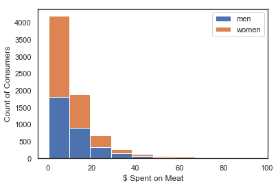

# Into the SoyVerse
Meat Consumption Chronicles

# Objective

Our objective was to use a linear regression model to predict an outcome using depedant(target) and independant(features) variables. 

In our analysis meat consumption was our depandant variable. We utilized 35+ features into our model to make our prediction.

# Data Collection

- BLS.gov/Consumer_Expendenture

- Interviewers - Bigger purchases

- Diary - Minor purchases

Collected by U.S Census Bureau

The **Consumer Expenditure Survey (CE)** is a nationwide household survey conducted by the U.S. Bureau of Labor Statistics (BLS) to find out how Americans spend their money.

- The C.E is the basis for the Consumer Price Index.
- Each quarter about **3,000** people kept a diaries for a two week period.

# Questions before Analysis

1) What is the impact of **meat consumption** on:
- Generation 
- Marital Status
- Region
- Gender 

2) Does **High Income** and **Small Family Size** mean more meat consumption?

# Exploratory Data Analysis

  What is the impact of **Generation** and **Marital Status** on meat consumption?

   
1) Observation - **Generation**

    Our observation shows Millennials are less likely to purchase meat than Baby Boomer
---
2) Observation - **Marital Status**

    Our observation shows married couples are more likely to purchase more meats than the other marital groups
---
Which **Region** eats more or less meat?

1) Observation - **Region**

 **Uncontrolled Group**
 

**Income Controlled Group**
   
    
    Our observation shows when we control for income, meat per person in the South becomes more pronounced
---
Which **Gender** consumes more or less meat?

1) Observation - **Gender**
   

   Our observation shows **women** are **more likely** to spend **less** on **meat** than **men**. The long right tail of the men money spent on meat histogram shows that **men** spend **more**.

----
Does **High-Income** and **Small Family Size** show more meat consumption

1) Observation - **High Income** and **Family Size**

    Our observation shows that low-income families and small family size tend to purchase more meat than families with higher income and bigger family size

----
# Modeling
  
## Features

### Linear Model - The Features 

#### Categorical
- Education - Categorical - 5 Variables
- Gender - Categorical - 2 Variables
- Location - Categorical - 4 Variables
- Marital Status- Categorical - 5 Variables
- Family Size- Categorical - 5 Variables

### Continous
- Meat Purchase - Continuous
- Tobacco Purchased - Continuous
- Alcohol Purchased - Continuous 
- Vegetables Purchased -Continuous 
- Income - Continuous/Categorical
- Age - Continuous/Categorical

**In total 35+ Features used in our model**

---
## Coeffiecients  

### Negative and Positive Coefficients

**Negative** Coefficients  

- Single Millennials 
-  Women Millennials
- Family Members of More Than Four 

**Positive** Coefficients
- Veggie Person
- No High School Education
- High Income
- Baby Boomers
- Men
- Two or More Family Members
---
# Model - One

### Residuals

# Model - Nine

### Residuals

# Conclusion

### Key Takeaways

From a business standpoint Baby Boomers from the South buy more meat which can lead to possible increase in sales.

